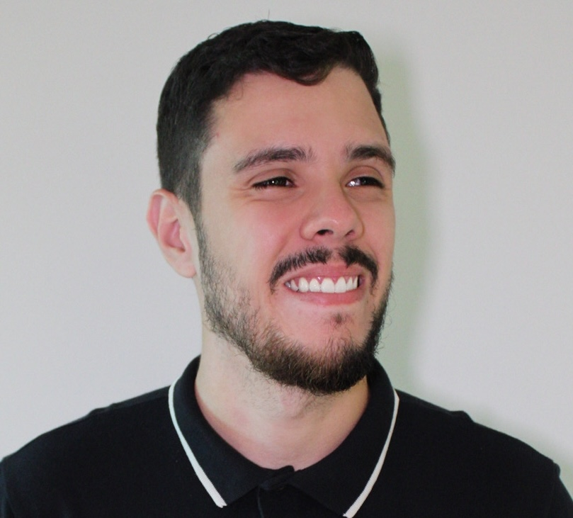

+++
title = 'About'
toc = false
draft = false
noComment = true
css = "about"
+++

I have degrees in Information Technology and Software Engineering, but most of what I know I learned by breaking things in production and fixing them. Twelve years in, I still like it that way.

## What I work on

Data infrastructure and backend systems: change data capture with Debezium and Kafka, streaming pipelines on Apache Beam and GCP Dataflow, MongoDB and Elasticsearch at the scale of hundreds of millions of records. Lately I've been working on AI tooling too, mainly exposing real production data to agents through MCP without letting them set anything on fire.

## Where I've been

- **Warmly**: founding engineer on the data team. I built the MCP server, migrated the data platform from Azure to GCP, and owned the pipelines behind contact enrichment and visitor identification.
- **io.insure**: founding engineer at an insurtech. This is where I learned payments, webhooks, and why idempotency matters.
- **BuildGroup**: founding engineer on an investment platform.
- **Buser**: backend engineering on a high-traffic Django platform.

## Stack I reach for

Python, Django, FastAPI, TypeScript/Node.js · PostgreSQL, MongoDB, Elasticsearch · GCP, Kubernetes, Docker, Kafka, Beam.
