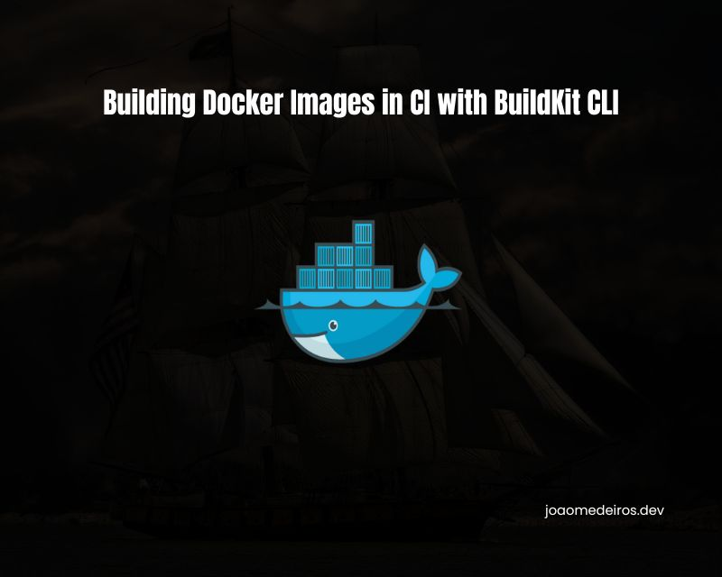

+++
title = 'Building Docker Images in CI with BuildKit CLI'
date = 2024-09-12
summary = 'Learn how to leverage BuildKit CLI to streamline your CI pipelines by building Docker images more efficiently. This guide covers setting up BuildKit in your CI environment, running rootless builds for enhanced security, and taking advantage of advanced features like caching and parallelism to speed up your Docker builds.'
toc = true
draft = false
tags = ["CI", "BuildKit", "Gitlab", "GitHub", "Docker"]
showTags = true
+++



>TL;DR: I recommend reading the entire post, but if you're in a rush, you can skip directly to the [examples section](#examples-of-usage-on-ci), where I show how to use BuildKit on GitHub Actions and Gitlab CI.


## Introduction
When it comes to building Docker images in CI pipelines, you have several options:

- [Docker in Docker (DinD)](https://www.docker.com/)
- [Kaniko](https://github.com/GoogleContainerTools/kaniko)
- [Buildah](https://buildah.io/)
- [BuildKit CLI](https://github.com/moby/buildkit)

Among these, only DinD is not rootless and daemonless, which can complicate its integration into CI pipelines without requiring the container to run in privileged mode.

At [Buser](https://linkedin.com/company/buserbrasil/), we initially adopted Kaniko as our rootless container builder. It was the best fit for our needs when we designed our CI pipelines. However, as part of a recent optimization task for the frontend Dockerfile build process, I explored transforming the image into a multi-stage Docker build. This approach aimed to better leverage caching and significantly reduce the final image size.

## The Problem

Adopting multi-stage builds for Docker images was a natural step for optimization. Multi-stage builds are highly beneficial, with the primary advantage being a significant reduction in the final image size. For instance, in our case, the size of the frontend image decreased from 1.1GB to 270MB—an impressive improvement.

> Multistage builds feature in Dockerfiles enables you to create smaller container images with better caching and a smaller security footprint.
>
> — <cite>[Advanced Dockerfiles: Faster Builds and Smaller Images Using BuildKit and Multistage Builds](https://www.docker.com/blog/advanced-dockerfiles-faster-builds-and-smaller-images-using-buildkit-and-multistage-builds/)</cite>


However, once I implemented the multi-stage build, I discovered that Kaniko was not fully suitable for our needs. Kaniko does not support parallelization of stages, as highlighted in an [open issue](https://github.com/GoogleContainerTools/kaniko/issues/1548) on their repository. This limitation adversely affected the performance of the image creation process.

Given this, the most logical alternative was to use Docker itself for building the image. Yet, Docker in Docker (DinD) presents its own challenges. It requires a root environment and a Docker daemon, which can impact both security and performance.

## The Solution: BuildKit CLI on our Gitlab CI
### What is BuildKit?
Docker has replaced the legacy builder by BuildKit since the version 23.0, however what some people don't know is that BuildKit is a standalone project and can be run independently of the docker daemon, you can see more details on the [official Docker page about BuildKit](https://docs.docker.com/build/buildkit/).

If you're curious (like me) on how that Docker implemented that, you can take a look at [buildx](https://docs.docker.com/reference/cli/docker/buildx/), basically buildx is just a wrapper to reduce the complexity of the BuildKit CLI that it's not that easy to understand.

### How to use BuildKit?
You should use the daemonless version of BuildKit, otherwise you will need a running instance of BuildKit, you can find below a simple example on how to call both CLIs:

#### Using BuildKit directly
```shell
buildctl-daemonless.sh build \
    --frontend=dockerfile.v0 \
    --local context=. \             # the current directory as context
    --local dockerfile=. \          # where to look for the Dockerfile
    --opt build-arg:XYZ=${XYZ} \    # passing build args to the Dockerfile
    --output type=image,name=myimage:v1.0,push=true
```

#### Using Docker's buildx
```shell
docker buildx build \
    --tag "${{ env.IMAGE_NAME }}/python:${{ github.sha }}" \
    --build-arg XYZ=${XYZ}
    --push \
    .
```

From the examples above, you can see that buildx is a lot simpler. The reason for that is Docker tried to keep options names the same as the legacy builder, that's why buildx feels more natural.

## Examples of usage on CI
I created a straightforward example containing a small multi-staged Dockerfile that executes a small Python code. On the CI we have two pipelines, the first (build-buildkit) will use BuildKit to build our Dockerfile, and the last (test-image) will run this image.

In this post, we'll only cover Gitlab CI and GitHub Actions. If you use another CI provider or another runner feel free to adapt the solution to your use case, and if you don't mind, please share it with us in the comments.

### Important
On the examples we have a very important technique to improve cache usage, check the two examples below:

```shell
# Gitlab
--export-cache type=registry,ref="${IMAGE_CACHE_NAME}:${CI_COMMIT_REF_SLUG}",mode=max \
--import-cache type=registry,ref="${IMAGE_CACHE_NAME}:${CI_DEFAULT_BRANCH}" \
--import-cache type=registry,ref="${IMAGE_CACHE_NAME}:${CI_COMMIT_REF_SLUG}"
```

```shell
#Github
--cache-to=type=registry,ref="${{ env.IMAGE_NAME }}/cache:${{ github.ref_name }}",mode=max \
--cache-from=type=registry,ref="${{ env.IMAGE_NAME }}/cache:main" \
--cache-from=type=registry,ref="${{ env.IMAGE_NAME }}/cache:${{ github.ref_name }}"
```

#### Branches cache

You may have seen it already, but we have two instructions to import the cache image and only one to export, but why? The cache is based on the branch, and if you're not running on your default branch you will have a cache miss on the first run of the pipeline. That's why we instruct buildkit to look in the default branch and the current branch for the cache.

#### Cache mode

A very important option to export your cache is to specify the mode (`mode_max`), from the official Docker documentation: "In min cache mode (the default), only layers that are exported into the resulting image are cached, while in max cache mode, all layers are cached, even those of intermediate steps" ([ref](https://docs.docker.com/build/cache/backends/)). That is not ideal for us if we're going into the multi-stage path, we will lose the cache from the earlier stages and will only have the cache for the final stage

### Gitlab
- [Repository](https://gitlab.com/joaomedeiros95/buildkit-ci-example)
- [CI Run Example](https://gitlab.com/joaomedeiros95/buildkit-ci-example/-/pipelines/1450766066)
- [gitlab-ci.yml](https://gitlab.com/joaomedeiros95/buildkit-ci-example/-/blob/main/.gitlab-ci.yml?ref_type=heads)

### GitHub
- [Repository](https://github.com/joaomedeiros95/buildkit-ci-example)
- [CI Run Example](https://github.com/joaomedeiros95/buildkit-ci-example/actions/runs/10838159895)
- [buildkit.yml](https://github.com/joaomedeiros95/buildkit-ci-example/blob/main/.github/workflows/buildkit.yml)

## Conclusion
If you don't have any direct reason to use BuildKit on your pipelines, I don't recommend going into this path, however, if you're facing security problems (containers running in privileged mode) or performance problems, I highly recommend using BuildKit on your CI. They're the market standard and support other container types besides Dockerfiles. If you don't know OCIs yet, I highly recommend you [take a look](https://opencontainers.org/).

> NOTE: I haven't had the opportunity to try [Buildah](https://buildah.io/) yet, but it seems promising too.