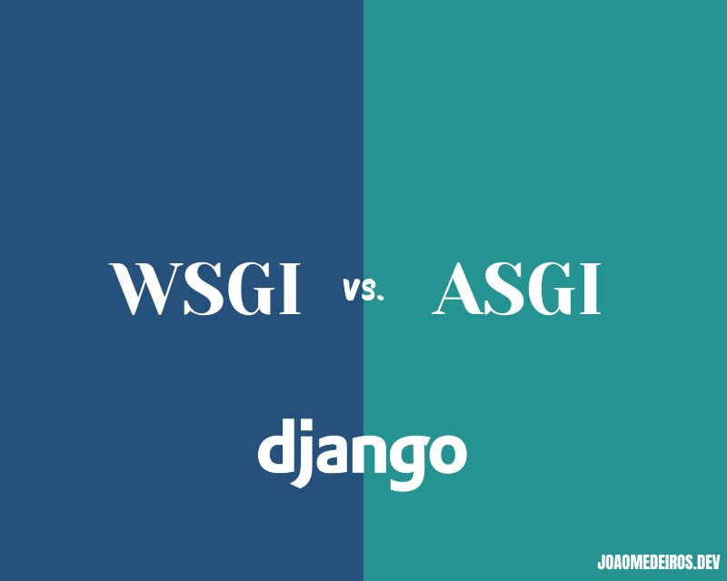
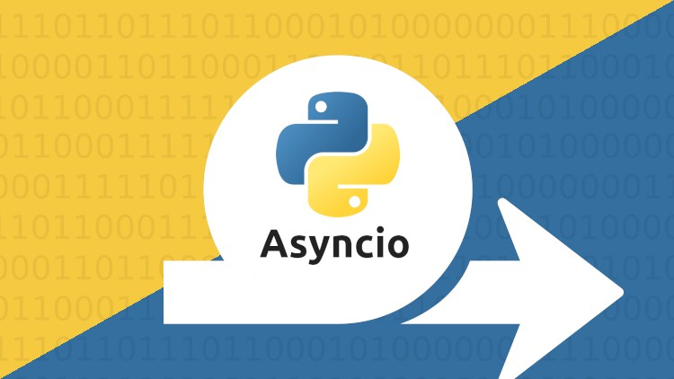
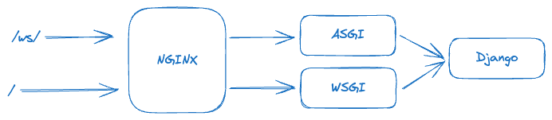

+++
title = 'Choosing Between WSGI and ASGI in Django: A Hybrid Approach for Optimal Performance'
date = 2024-09-30
summary = 'In some Django projects, tackling a mixed environment using WSGI and ASGI could be more beneficial. This guide will cover a use case where I had to use both ASGI and WSGI in the same API.'
toc = true
draft = false
tags = ["Python", "Django", "API", "WSGI", "ASGI", "Performance", "DRF"]
showTags = true
+++



## Introduction
WSGI and ASGI are Python specifications for creating web applications, WSGI is defined on [PEP 333](https://peps.python.org/pep-0333/) and updated on [PEP 3333](https://peps.python.org/pep-3333/) and ASGI is specified on the [ASGI documentation](https://asgi.readthedocs.io/en/latest/specs/main.html). The main difference between those two is that WSGI is designed for synchronous applications and ASGI for asynchronous applications (but it can work with sync, too).

Here is a simple comparison between the two specifications:

| Feature                  | WSGI                                        | ASGI                                      |
|--------------------------|---------------------------------------------|-------------------------------------------|
| **Processing Model**      | Synchronous                                 | Asynchronous (supports synchronous too)   |
| **Concurrency**           | Limited to one request per worker at a time | High concurrency with `asyncio`           |
| **Protocol Support**      | Primarily HTTP                              | Multiple protocols (HTTP, WebSockets, etc.)|
| **Use Cases**             | Traditional web apps, REST APIs             | Real-time apps, WebSockets, async APIs    |
| **Server Implementations**| Gunicorn, uWSGI, Waitress                   | Daphne, Uvicorn, Hypercorn                |

A common mistake that one can make is trying to fit an entire application only in one specification. On a previous project, I started using WSGI, and after some time, we had to introduce Websockets, at that time I decided to migrate our whole API to use ASGI, this was a big mistake.

## Python asyncio
### Advantages


If you have an IO-bound API, having async is a must. Async will let Python run another process while waiting for some IO process to finish. A great article to understand more about async in Python you can find [here](https://realpython.com/async-io-python/).

However, if you have a CPU-bound API async is not for you, you will not see any difference in using it.

### Django Async support
[Asynchronous support](https://docs.djangoproject.com/en/5.1/topics/async/) was introduced to Django after version 3.1 and has improved a lot since then, however, other libraries still don't support it, for example, [DRF still didn't implement](https://github.com/encode/django-rest-framework/issues/8496) any support to it and probably will not for a while. In the project I mentioned we were using Graphene for GraphQL support that also [doesn't support it](https://github.com/graphql-python/graphene-django/discussions/1449).

Having a mixed environment has some performance implications, if you have sync code on ASGI or async code in WSGI, Django will need to take some additional steps so your code can run. You can see more details in the [Django documentation](https://docs.djangoproject.com/en/5.1/topics/async/#performance).

## The Problem
After using ASGI for the whole API, we noticed the application's performance was not good. Even scaling the API horizontally, we saw some requests hanging. Every developer tends to be a little perfectionist, I knew the problem was the lack of async support on Graphene and DRF, but instead of going into the easier path I tried to make Graphene work asynchronously.

Django has a a handy function called [sync_to_async](https://docs.djangoproject.com/en/5.1/topics/async/#sync-to-async), that let you transform any sync code into async, I tried to wrap the Graphene core functionalities using that function but the habbit hole was bigger than I thought and in the end I gave up.

It took me a while to figure out that I should have a mixed environment leveraging both ASGI and WSGI instead of trying to force async behavior on my whole API.

## The Solution
As I mentioned before, the simplest solution was to create a mixed environment, we left the Graphene and DRF endpoints running on WSGI and WebSockets running on ASGI, we used NGINX to handle the traffic between the two.



Below you can find an example of the NGINX conf file to run the mixed environment:

```conf
worker_processes auto;

events {
    worker_connections 1024;
}

http {
    access_log /dev/stdout;
    error_log /dev/stderr;

    upstream ws_server {
        server 127.0.0.1:9000;
    }

    upstream app_server {
        server 127.0.0.1:8000;
    }

    server {
        listen 80;

        client_max_body_size 50M;

        location / {
            proxy_pass http://app_server;
            proxy_set_header Host $host;
            proxy_set_header X-Real-IP $remote_addr;
            proxy_set_header X-Forwarded-For $proxy_add_x_forwarded_for;
            proxy_set_header X-Forwarded-Proto $scheme;
        }

        location /ws/ {
            proxy_pass http://ws_server/;

            proxy_http_version 1.1;
            proxy_set_header Upgrade $http_upgrade;
            proxy_set_header Connection "upgrade";

            proxy_redirect off;
            proxy_set_header Host $host;
            proxy_set_header X-Real-IP $remote_addr;
            proxy_set_header X-Forwarded-For $proxy_add_x_forwarded_for;
            proxy_set_header X-Forwarded-Host $server_name;
        }
    }
}
```

To keep everything running smoothly we leveraged supervisord, in there we managed the following services:

- Nginx
- Gunicorn: to run WSGI endpoints
- Daphne: to run ASGI endpoints
- Channels: to manage websockets messages

```conf
[supervisord]
nodaemon=true
logfile=/dev/null ;

[program:nginx]
command=/usr/sbin/nginx -g 'daemon off;'
autostart=true
autorestart=true
redirect_stderr=true
stdout_logfile=/dev/stdout
stdout_logfile_maxbytes=0

[program:gunicorn]
command=/bin/bash -c "/opt/venv/bin/gunicorn $STATSD_ARGS project.wsgi:application"
autostart=true
autorestart=true
redirect_stderr=true
stdout_logfile=/dev/stdout
stdout_logfile_maxbytes=0

[program:daphne]
command=/opt/venv/bin/daphne -b 0.0.0.0 -p 9000 project.asgi:application
autostart=true
autorestart=true
redirect_stderr=true
stdout_logfile=/dev/stdout
stdout_logfile_maxbytes=0

[program:channels]
command=/bin/bash -c "python /app/manage.py runworker channels"
autostart=true
autorestart=true
redirect_stderr=true
stdout_logfile=/dev/stdout
stdout_logfile_maxbytes=0
```

## Conclusion
If you're starting a new Django project, I suggest you deeply consider using async, projects in the early stages are much easier to introduce asyncio.  Look at [ADRF](https://github.com/em1208/adrf) if you're using DRF and [Strawberry](https://strawberry.rocks/) if you need GraphQL.

In mature projects, it will probably be easier to maintain a mixed environment and migrate the IO-bound endpoints progressively.

How about you? Do you prefer using WSGI or ASGI for your projects?