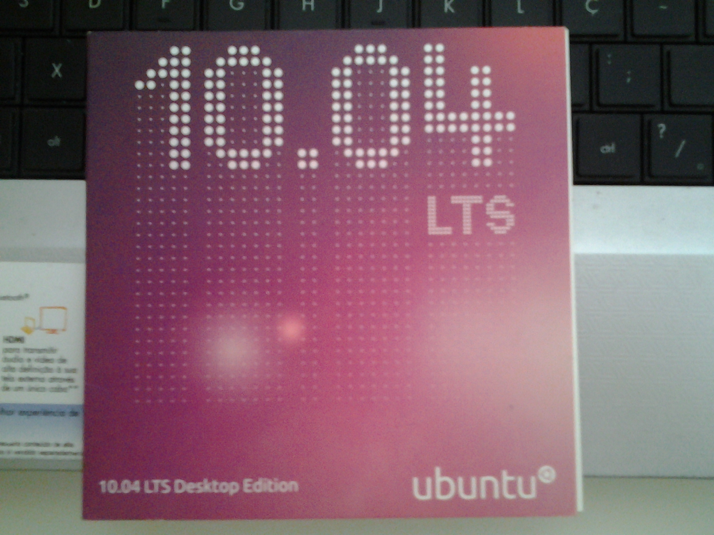
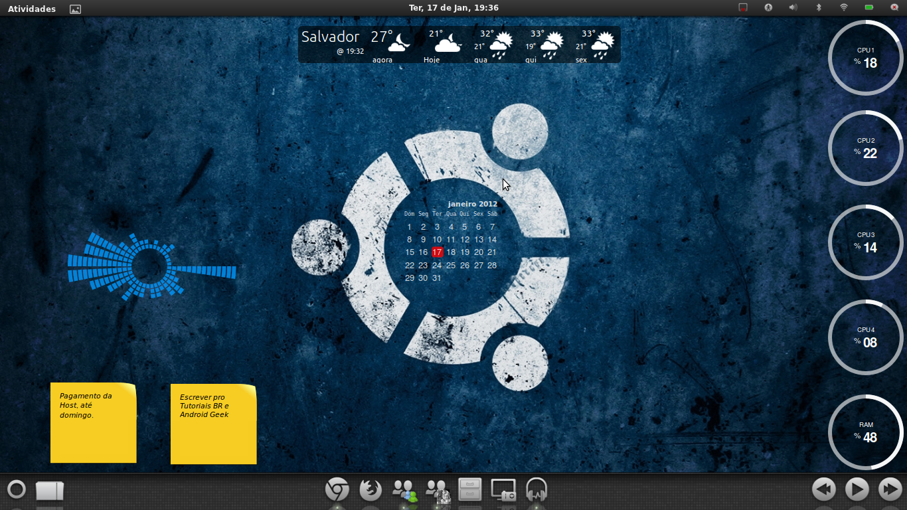

+++
title = 'My history with Linux'
date = 2024-10-02
summary = 'In this post, I reflect on my journey with Linux, from my early days as a beginner to becoming a power user and developer.'
toc = true
draft = false
tags = ["Linux", "Ubuntu", "history"]
showTags = true
+++

## Introduction
I've always been a curious guy (I'll write a post later about how this helped me in being a better developer), when I was a kid I loved not only playing with my toys but also disassembly them to discover how they work. After a few years of having access to computers, when I was a teenager, I wondered if there was any other OS besides Windows and I discovered Linux.

## The Journey
### Ubuntu 10.04 CD

In 2010, when I was 15, I discovered Linux and also that Canonical at that time would send free installation CDs to your home, I ordered one as at that time I had a bad internet connection. As soon as I received the CD I installed it with dual boot on my Windows computer, that was the beginning of my path with Linux.

In the same period, I started a tech blog. In 2010 we had a few Brazilian blogs where we could seek tutorials about Linux or more advanced topics, that's the reason I created my own. I didn't have the habit of using Ubuntu daily, so I decided to start a challenge to use Ubuntu for 30 days straight and document the process.

After that, I completely fell in love with Linux and I didn't look back since then.

### The decision to be a programmer
These two events in my life, creating a blog and using Linux daily, made me decide very early that I wanted to be a Software Engineer. I started messing with my Ubuntu to customize it, I tested other distributions and broke my computer several times, it was an amazing experience and it helped me a lot when I started college.

*A customization I made in 2012 with my Ubuntu Dekstop.*

When I started college and my first internship, my previous experience with Linux helped a lot, I was able to successfully maintain and spin up Linux servers with a very minimum learning curve, making my professional evolution very steep. Taking a look back in time, I would probably take more time to evolve as an engineer if I didn't know Linux when I first needed it.

### Linux today
Today, almost 15 years later, Linux is much more popular, most programmers today will prefer using Linux or MacOS (Unix) instead of Windows. I've been using both Mac and Linux for five years now for many purposes, Linux mainly for programming stuff and hosting services on a dedicated local server and Mac for personal projects and other stuff.

I love self-hosting a bunch of services, I may talk about them in a future post, I have a backup service to backup my local file + Google Drive/Photos, a private git instance, monitoring tools, and much more, everything running on my local server running on top of Linux.

In my free time, I love to test new Linux distributions.

### Android
I was introduced to the freedom of Linux very early, and I got used to it very fast. Android is based on Linux and was the perfect opportunity to extend my passion to a mobile device, ten years ago I loved trying customized Android ROMs, I was accessing [XDA Forums](https://xdaforums.com/) daily and I loved it. I tried AOSP, CyanogenMod, and EMUI, old times that would never come back.

For that reason today I still can't use anything else. I tried using an iPhone for a year in 2022 but I went back to Android very fast. iOs is very good and consistent but we have zero opportunities to deeply customize the system, I use [Tasker](https://tasker.joaoapps.com/) (if you use Android, please take a look) extensively to automate my life, one example is an automation that allows me to keep track of my finances automatically when notifications from the bank arrive, and the expenses are automatically sent to a Google Spreadsheet. This simple automation saved me many hours and unfortunately, Apple doesn't let us even read notifications using other apps, I can't live with that.

## Conclusion
Unless you're a Windows developer or only use Microsoft languages you should know Linux and/or Unix. Most of the opportunities on the market today would ask for Docker, Cloud, and Kubernetes experience at least, knowing Linux/Unix and using it daily will help you a lot.

How about you? Do you agree? What is your history with Linux/Unix?